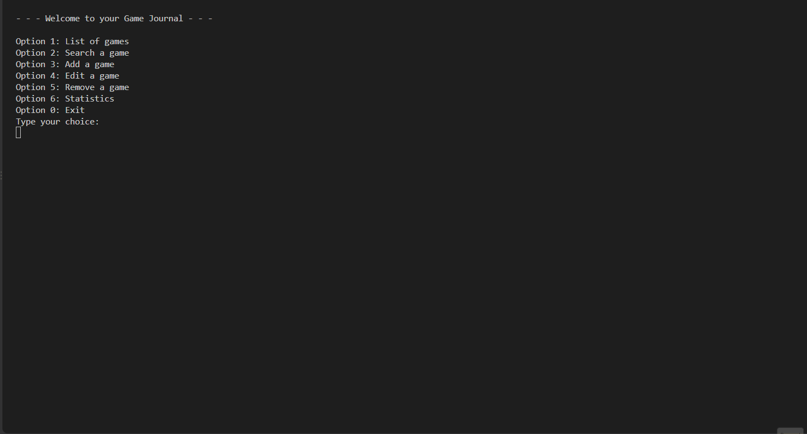
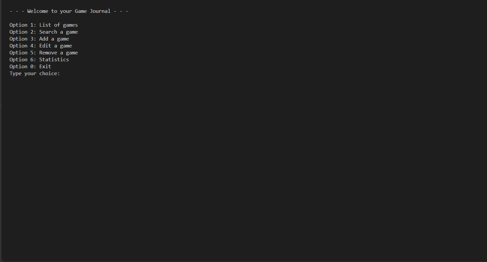
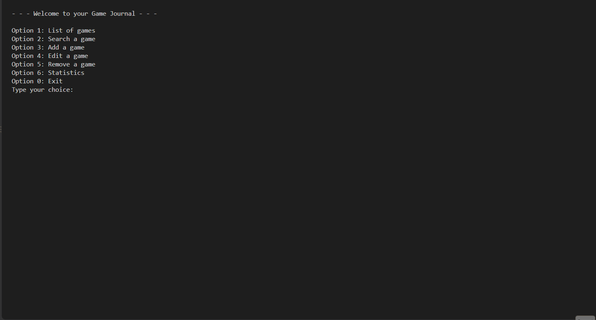
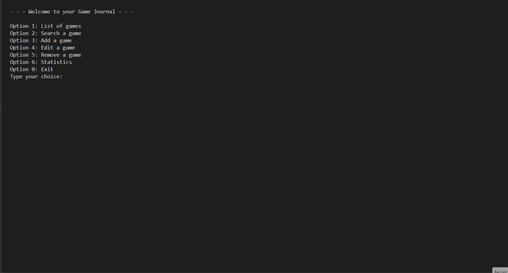

# Backlog — Game Journal

A terminal-based personal game journal built in Python as a pair-programming learning exercise. It lets you catalogue, search, edit, remove, and get statistics on the games you've played, are playing, or want to play — with all data persisted locally as JSON.

This project was built as a Computer Science course challenge, with a deliberate focus on **practicing core programming logic** (conditionals, loops, data validation, and clean function design) rather than shipping the fastest or flashiest solution. See [Design philosophy](#design-philosophy) below for what that meant in practice.

## Features

- **Add a game** — name, console, genre, year, rating (0–5), and status (`Playing`, `Completed`, `Want to Play`, `Abandoned`), with full input validation and a confirmation step before saving.
- **List all games** — a formatted table of the entire collection.
- **Search & filter** — by name (partial match), status, console, genre, or a year range.
- **Edit a game** — find it by name, pick which field to change, and confirm before the change is applied.
- **Remove a game** — find it by name and confirm before deleting.
- **Statistics** — total games, average rating, highest/lowest rated game, plus a breakdown (count + average rating) by status, console, or genre.
- **Persistence** — the full journal is saved to `game_list.json` after every change, and reloaded automatically the next time the program starts.
- **Robust input handling** — invalid input (empty fields, non-numeric input, out-of-range values) never crashes the program; the user is prompted to try again.

## Demo

**Listing all games**


**Adding a game**


**Searching**


**Editing a game**


**Removing a game**


**Statistics**


## Requirements

- Python 3 (no version-specific syntax is used)
- No external dependencies — only the standard library (`json`, `datetime`).

## How to run

```bash
python main.py
```

The first run creates `game_list.json` in the project folder once you add your first game. Subsequent runs automatically load your saved journal.

## Project structure

```
GameJournal/
├── main.py       # Orchestration: menu loop, wires data.py + functions.py together
├── functions.py  # All business logic (validation, search, statistics, persistence)
├── data.py       # Static data: allowed values, error messages, dispatch tables
└── game_list.json  # Generated at runtime — not committed (see .gitignore)
```

The dependency direction is intentionally one-way to avoid circular imports:

```
functions.py  →  (nothing project-specific)
data.py       →  functions.py
main.py       →  data.py + functions.py
```

`functions.py` never imports from `data.py`, which is why lists like `game_list` are always passed into functions as parameters rather than imported directly.

## Data model

Each game is a dictionary; the full collection is a list of these dictionaries (no external database):

```python
{
    'id': 1,
    'name': 'Final Fantasy',
    'genre': 'Fantasy',
    'console': 'Playstation 3',
    'year': 2010,
    'rate': 4.2,
    'status': 'Playing'
}
```

| Field     | Type  | Notes                                                              |
|-----------|-------|---------------------------------------------------------------------|
| `id`      | int   | Sequential, calculated as `max(existing ids) + 1` (never a saved counter — see below) |
| `name`    | str   | Required, unique across the journal                                |
| `genre`   | str   | One of a fixed list                                                 |
| `console` | str   | Required, free text                                                 |
| `year`    | int   | 1900 to the current year                                            |
| `rate`    | float | 0.0 to 5.0, one decimal place                                       |
| `status`  | str   | One of `Playing`, `Completed`, `Want to Play`, `Abandoned`           |

## Design philosophy

Since the goal was to practice programming logic, a few choices were deliberately made *against* the "quickest" solution:

- **No GUI.** A terminal-only interface was chosen over Tkinter/Streamlit/Flask specifically because GUI/web frameworks that abstract away data display would have reduced practice with the loops and conditionals the exercise was meant to reinforce. A graphical interface is left as an idea for a future project.
- **JSON over SQLite.** JSON was chosen for persistence because it serializes the existing "list of dictionaries" structure natively, without introducing SQL — a concept intentionally kept out of scope for this project.
- **Manual loops over built-ins, in some places.** For example, `get_total_statistics` finds the highest/lowest rated game with a single manual loop rather than `max()`/`min()` with a `key=` lambda, specifically to reinforce loop/conditional practice. (`max()` *is* used elsewhere, like for calculating the next sequential `id`, where the loop itself wasn't the point.)

## Architecture & patterns

A few reusable patterns run through the whole codebase:

- **Consistent return types.** Any function that validates input either returns the valid value or `None` — never a mix of a value and an error string. Error messages are resolved separately, via `error_message_dictionary` (keyed by an `input_type` string each validator also returns).
- **Generic retry loop — `is_input_valid`.** A single function drives the "ask, validate, repeat until valid" loop for every free-text field (name, console, year, rate), so that loop only needed to be written once.
- **`lambda` for extra parameters.** Some validators (like the name-duplicate check) need an extra argument (`game_list`) that the generic retry loop doesn't know how to pass. Rather than special-casing this inside the loop, the call site wraps it in a zero-argument `lambda`, keeping `is_input_valid` fully generic.
- **Dispatch via dictionaries.** Search/filter criteria map to their corresponding function through a dictionary of function references (`filter_functions`), rather than a long `if`/`elif` chain.
- **Shared add/edit/delete confirmation flow.** All three data-mutating operations follow the same shape: build the change without applying it, show it to the user, ask for confirmation in a loop, and only then apply it (`.append()` / `.update()` / `.remove()`) and persist to disk. A single `confirm_new_game(game_list, modify_game, *args)` function handles the confirmation UI and disk write for all three, using `*args` to forward whatever each operation-specific function (`create_new_game`, `edit_game`, `delete_game`) needs.
- **Edit-safe copies.** Editing a game works on a `.copy()` of its dictionary, not the original — the real entry (which lives by reference inside `game_list`) is only updated (via `.update()`, located by `id`) after the user confirms. This avoids a bug where a "no" response would still leave the edit applied. Because the original entry is still present in `game_list` while editing, the name-duplicate check accepts an optional `game_id` to ignore during comparison — otherwise renaming a game to its own existing name would be (incorrectly) flagged as a duplicate.
- **Sequential IDs without a saved counter.** New IDs are computed as `max(existing ids) + 1` from the current list, rather than a separately tracked counter, a timestamp, or a UUID — this keeps the `id` an `int` as specified, and correctly avoids collisions even after a game is deleted (unlike `len(list) + 1`, which can reintroduce a duplicate ID after a deletion).

## Known limitations / future work

- **Table and statistics formatting are placeholders.** Column-aligned tables (`print_games`, `confirm_new_game`) and the statistics display (`print_all_stats`, `print_stats_per_option`) were written as temporary output so the backend logic could be tested end-to-end; per the team's task split, finalizing this presentation layer is a separate piece of work.
- **No GUI**, by design (see [Design philosophy](#design-philosophy)) — a candidate for a future iteration of this project.
- **Single-user, local file only.** `game_list.json` lives next to the script; there's no multi-device sync or backup.

## Team & workflow

Built by a pair for a Computer Science course. Work was split by responsibility (backend logic vs. terminal presentation) rather than by feature, with roles intended to swap on the next project. Development followed a "data layer first, then interaction layer" order, per the challenge's requirements.
